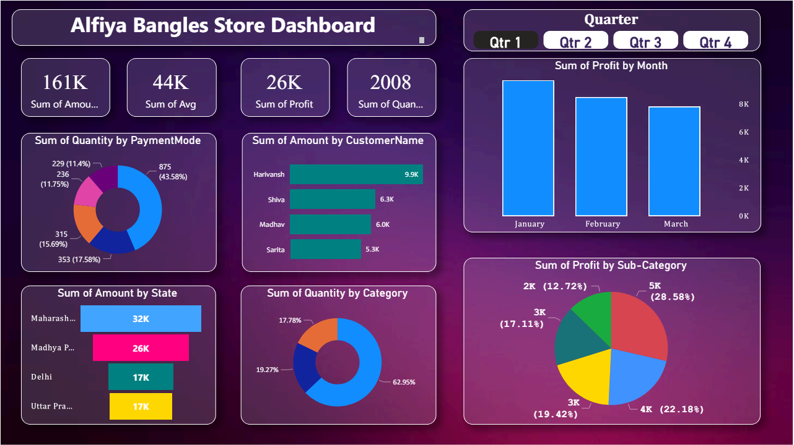

# Power BI Dashboard Project - FirstDashboard

## Overview

This repository contains the Power BI dashboard project named **FirstDashboard**. The dashboard visualizes sales and customer data from a retail store, providing insights into various aspects such as quantity sold, amount, profit, customer distribution, and payment methods.

## Sample Dataset

The dashboard is built using the following sample dataset:

### Table 1: Sales Data

| Order ID | Amount | Profit | Quantity | Category           | Sub-Category        | PaymentMode |
|----------|--------|--------|----------|--------------------|---------------------|-------------|
| B-25681  | 1096   | 658    | 7        | Puja Material      | Dhup                | COD         |
| B-26055  | 5729   | 64     | 14       | Ladies Accessories | Wedding Material    | EMI         |
| B-25955  | 2927   | 146    | 8        | Ladies Accessories | Sewing Accessories  | EMI         |
| B-26093  | 2847   | 712    | 8        | Puja Material      | Ittar               | Credit Card |

### Table 2: Customer Data

| Order ID | Order Date | CustomerName | State         | City    |
|----------|------------|--------------|---------------|---------|
| B-26055  | 10-03-2018 | Harivansh    | Uttar Pradesh | Mathura |
| B-25993  | 03-02-2018 | Madhav       | Delhi         | Delhi   |
| B-25973  | 24-01-2018 | Madan Mohan  | Uttar Pradesh | Mathura |

## Dashboard Preview

Below is a preview of the dashboard created in Power BI:

## Features

The dashboard includes the following features:

1. **Total Metrics**:
    - Sum of Amount
    - Sum of Profit
    - Sum of Quantity

2. **Visualizations**:
    - Sum of Quantity by Payment Mode (Pie Chart)
    - Sum of Amount by Customer Name (Bar Chart)
    - Sum of Profit by Month (Bar Chart)
    - Sum of Profit by Sub-Category (Pie Chart)
    - Sum of Amount by State (Bar Chart)
    - Sum of Quantity by Category (Pie Chart)

## Instructions for Use

1. **Dataset Preparation**:
    - Ensure you have the sales and customer data in two separate tables as shown above.

2. **Loading Data into Power BI**:
    - Open Power BI Desktop.
    - Import the dataset into Power BI.
    - Make sure to establish relationships between the tables based on the `Order ID`.

3. **Creating the Dashboard**:
    - Use the 'Visualizations' pane to create various charts and metrics as shown in the dashboard preview.
    - Customize the visuals by adding titles, data labels, and adjusting the colors to enhance readability.

4. **Saving and Sharing**:
    - Save the Power BI report.
    - Export the dashboard as a `.pbix` file or share it directly via Power BI Service.

## Files in the Repository

- `FirstDashboard.pbix`: The Power BI project file.
- `README.md`: This readme file.
- `screenshot.png`: Screenshot of the dashboard.

## Notes

- The data used in this project is for demonstration purposes only.
- Ensure data privacy and compliance when using real data.
